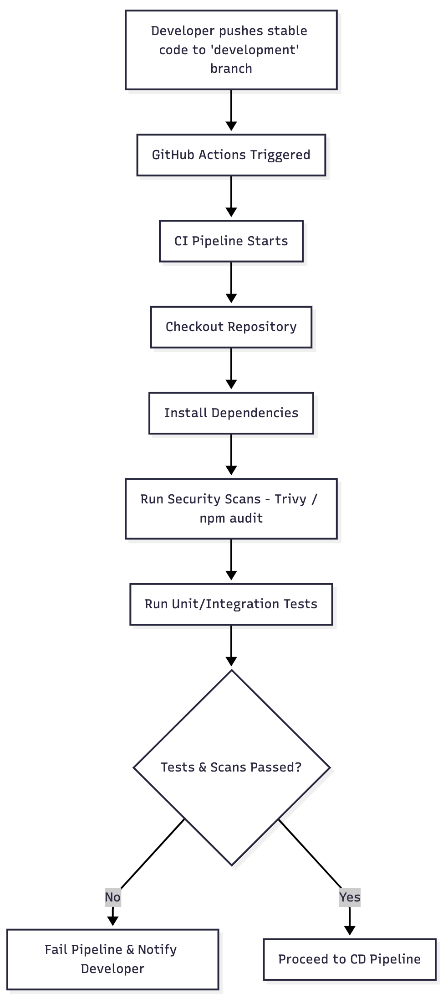
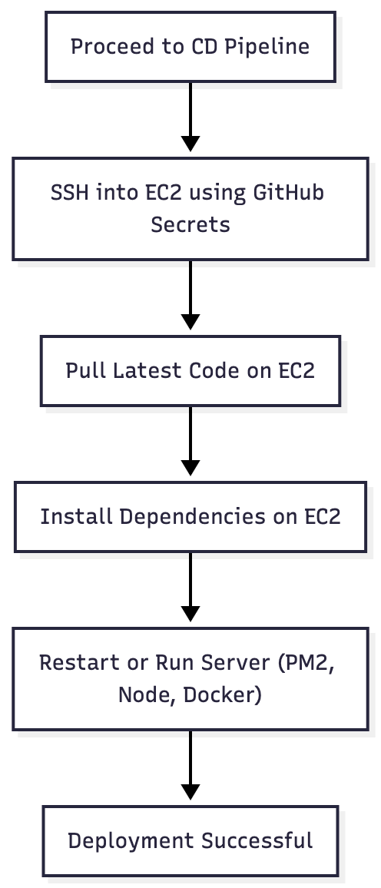

# CI/CD Workflows

## CI Workflow

The **Continuous Integration (CI) workflow** starts when a developer pushes stable
code into the **development** branch.

GitHub Actions then:

- Checks out the repository
- Installs dependencies
- Runs security scans
- Executes unit & integration tests

If all checks pass, the pipeline continues to the CD stage.

---

## CD Workflow

The **Continuous Deployment (CD) workflow** connects to the EC2 instance using
GitHub Action secrets. It then:

- Pulls the latest code
- Installs dependencies on EC2
- Restarts the server (PM2)

Once completed, the deployment is marked successful.
