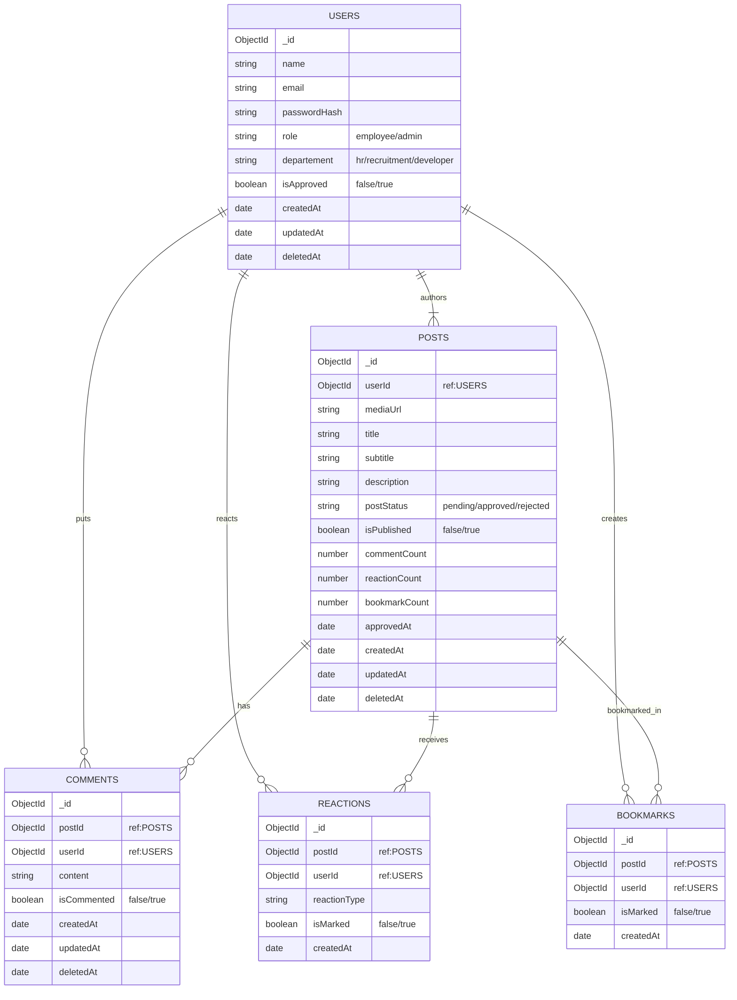

```mermaid
erDiagram
	direction TB
	USERS {
		ObjectId _id  ""
		string name  ""
		string email  ""
		string passwordHash  ""
		string role  "employee/admin"
		string departement "hr/recruitment/developer"
		boolean isApproved  "false/true"
		date createdAt  ""
		date updatedAt  ""
		date deletedAt  ""
	}
	POSTS {
		ObjectId _id  ""
		ObjectId userId  "ref:USERS"
		string mediaUrl  ""
		string title  ""
		string subtitle  ""
		string description  ""
		string postStatus  "pending/approved/rejected"
		boolean isPublished  "false/true"
		number commentCount  ""
		number reactionCount  ""
		number bookmarkCount  ""
		date approvedAt  ""
		date createdAt  ""
		date updatedAt  ""
		date deletedAt  ""
	}
	COMMENTS {
		ObjectId _id  ""
		ObjectId postId  "ref:POSTS"
		ObjectId userId  "ref:USERS"
		string content  ""
		boolean isCommented "false/true"
		date createdAt  ""
		date updatedAt  ""
		date deletedAt  ""
	}
	BOOKMARKS {
		ObjectId _id  ""
		ObjectId postId  "ref:POSTS"
		ObjectId userId  "ref:USERS"
		boolean isMarked "false/true"
		date createdAt  ""
	}
	REACTIONS {
		ObjectId _id ""
		ObjectId postId  "ref:POSTS"
		ObjectId userId  "ref:USERS"
		string reactionType  ""
		boolean isMarked "false/true"
		date createdAt  ""
	}
	USERS||--|{POSTS:"authors"
	USERS||--o{COMMENTS:"puts"
	USERS||--o{REACTIONS:"reacts"
	USERS||--o{BOOKMARKS:"creates"
	POSTS||--o{COMMENTS:"has"
	POSTS||--o{REACTIONS:"receives"
	POSTS||--o{BOOKMARKS:"bookmarked_in"


```
