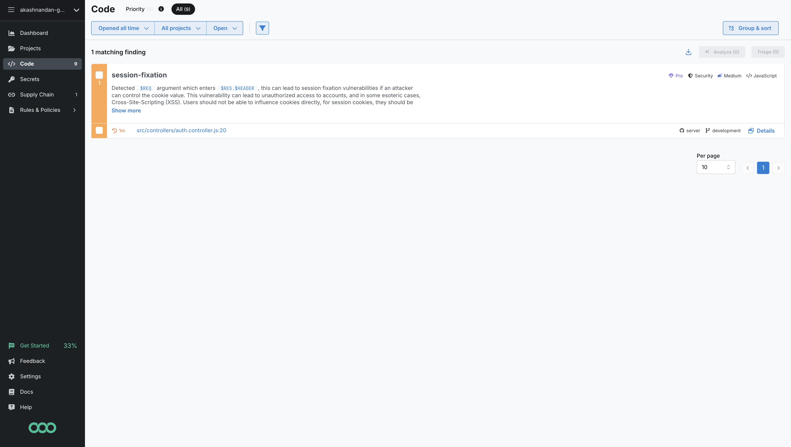
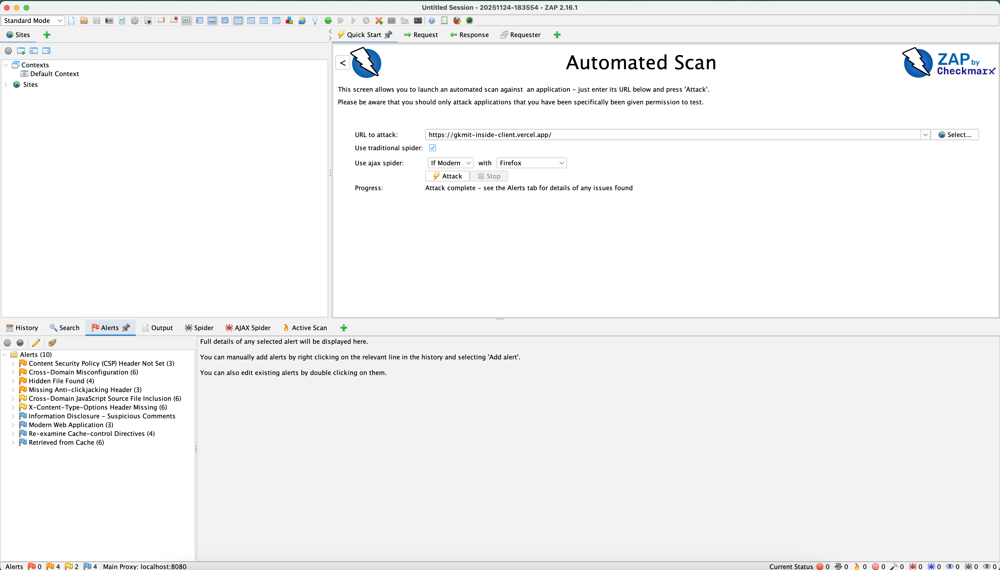
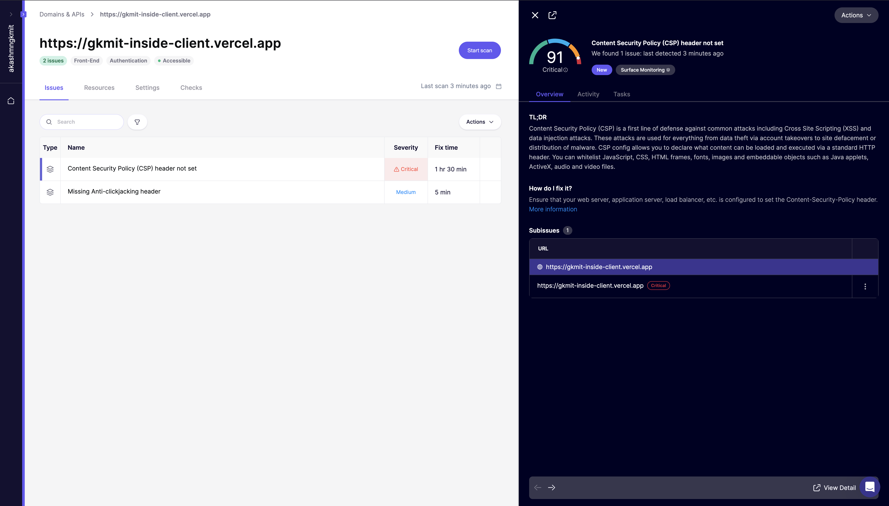
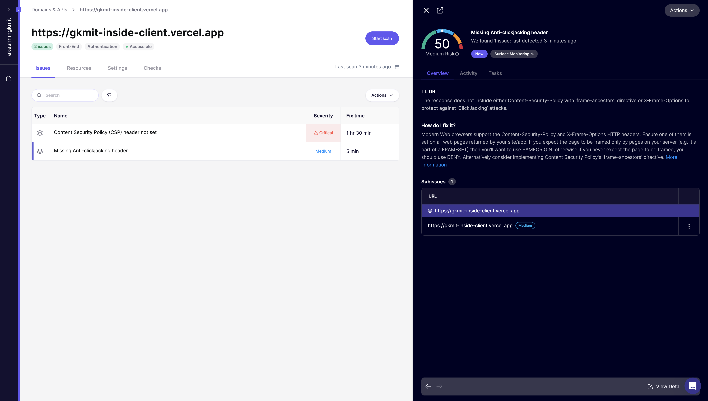

# Security Scanning

## Overview of Security Scanning

Security scanning is a crucial process in the software development lifecycle designed to identify and remediate security vulnerabilities within applications. Security scanning is broadly categorized into several types, with Static Application Security Testing (SAST) and Dynamic Application Security Testing (DAST).

### Static Application Security Testing (SAST)

 It inspects the application from the inside out, looking for common coding errors, configuration issues, and known vulnerability patterns.

### Dynamic Application Security Testing (DAST)

 It simulates attacks from an external perspective, sending various inputs and monitoring the application's responses to identify vulnerabilities like SQL injection, Cross-Site Scripting (XSS), and insecure server configuration.

## SAST with Trivy

Trivy is highly effective at detecting vulnerabilities in OS packages, application dependencies, and infrastructure-as-code (IaC) files.

### Example Trivy Scan Report

The following is an example output from a Trivy scan performed on project's dependencies. This report summarizes the findings, showing the target file, the type of scan, and the number of vulnerabilities or secrets found.

```
2025-11-24T17:45:05+05:30       INFO    [vulndb] Need to update DB
2025-11-24T17:45:05+05:30       INFO    [vulndb] Downloading vulnerability DB...
2025-11-24T17:45:05+05:30       INFO    [vulndb] Downloading artifact...        repo="mirror.gcr.io/aquasec/trivy-db:2"
75.99 MiB / 75.99 MiB [---------------------------------------------------------------------------------------------------------------------------------------------------------------------------------------------------] 100.00% 9.90 MiB p/s 7.9s
2025-11-24T17:45:16+05:30       INFO    [vuln] Vulnerability scanning is enabled
2025-11-24T17:45:16+05:30       INFO    [secret] Secret scanning is enabled
2025-11-24T17:45:17+05:30       INFO    Suppressing dependencies for development and testing. To display them, try the '--include-dev-deps' flag.

Report Summary
┌───────────────────┬──────┬─────────────────┬─────────┐
│      Target       │ Type │ Vulnerabilities │ Secrets │
├───────────────────┼──────┼─────────────────┼─────────┤
│ package-lock.json │ npm  │        0        │    -    │
└───────────────────┴──────┴─────────────────┴─────────┘
Legend:
- '-': Not scanned
- '0': Clean (no security findings detected)
```

## SAST with Semgrep

 It uses a simple, `grep`-like syntax to write custom rules, making it highly flexible and powerful for our codebase.

### Example Semgrep Scan Report

The following image shows a report from a Semgrep scan, detailing the rules that were triggered and the locations of the potential issues in the code.



## DAST with OWASP ZAP

For Dynamic Application Security Testing (DAST), we use the OWASP Zed Attack Proxy (ZAP), one of the world’s most popular free security tools. It helps automatically find security vulnerabilities in running web applications during the developing and testing phases.

### ZAP Scan Report

Below is an image from a ZAP scan, which shows the alerts and vulnerabilities found in the application.



## Scans with Akido

### Cross-Site Request Forgery (CSRF) Report

This report details a CSRF vulnerability identified by the Akido scan.



### Clickjacking Report

This report details a Clickjacking vulnerability identified by the Akido scan.


